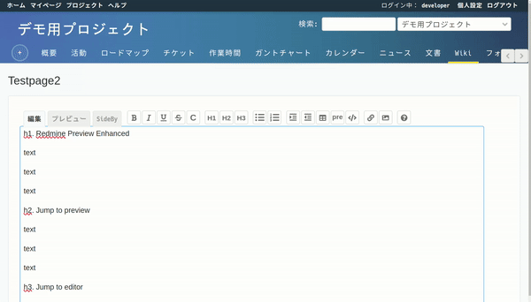
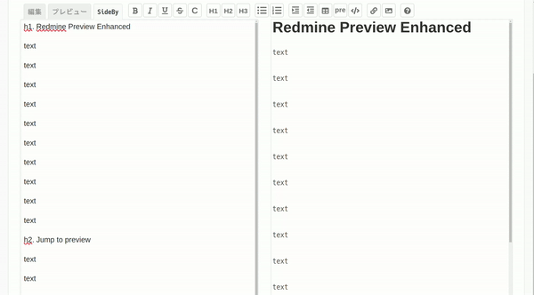
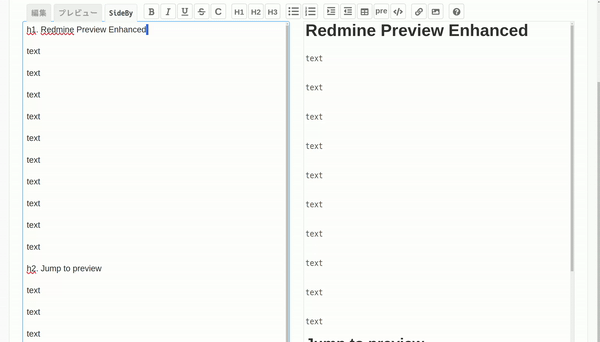

WIP

# redmine Preview Enhanced

A Chrome/Edge Extension to be able to edit redmine with the preview.

## Instration

1. Clone this repository
2. `Load Unpacked` from `chrome://extensions/`

[Read more](https://knowledge.workspace.google.com/kb/load-unpacked-extensions-000005962)

## Usage

1. Open the redmine wiki.
2. Click on the popup and enter the redmine URL.(ex. https://your.redmine.com)
3. Click `Edit` to start editing the wiki.
4. Click on the `SideBy` tab when it appears.
* 
5. Double-click the text on the editing screen to jump to the corresponding preview.
* 
6. Double-click on the text in the preview to jump to the corresponding preview.
* 
7. Click the SideBy tab again to update the preview.
8. Lets write your wiki!

## Future development
- [ ] Jump Function Enhancement
